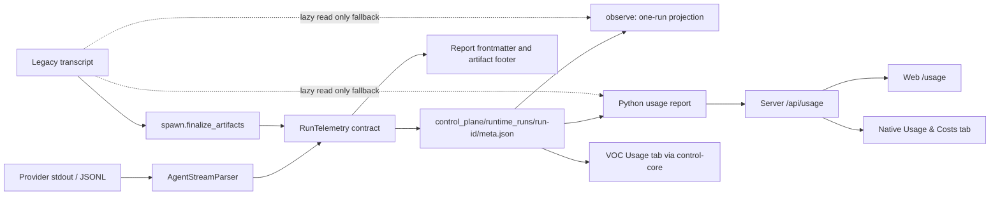

# Vibecrafted telemetry and usage-reporting surface

Snapshot: `feat/telemetry-dashboard@f61c5d61c3edbcaebf274192daf54bf60d7511d8`

Loctree coverage: 1459 of 1459 indexed files. Ten `loct` calls were used. The
first failed on the sandboxed global cache; the remaining calls used a fresh,
repo-local snapshot. Source inspection below was bounded by the resulting
files and symbols.

## Baseline truth

Vibecrafted already has a coherent, local per-run telemetry contract. It
captures provider usage, cost, model, provider session identity and failure
attribution; writes them into run metadata and report frontmatter; and can
aggregate them through a Python CLI report.

At the baseline there was no usage dashboard. The web server, native app and
VOC did not consume the usage schema or its token/cost fields. The public shell
command deck also did not route `vibecrafted usage` to the Python
implementation.

`telemetry smoke` is a separate marbles runtime smoke test. It neither reports
product usage nor feeds a dashboard.

## Implemented cut

- `usage_reporting.py` is the reusable Python projection behind the CLI, and
  both public launcher copies route `vibecrafted usage` to it.
- `control-core` owns a read-only `UsageReport`; the server exposes it at
  `/api/usage` and renders the human dashboard at `/usage`.
- VOC has a fifth `Usage` tab, backed by the same control-core report rather
  than a second parser.
- VibecraftedApp registers `Usage & Costs` as a runtime-scoped native
  destination at `/usage`.
- Every supported provider has a separate read-only analytical adapter:
  `agy`, `claude`, `codex`, `cursor`, `grok`, `junie`, and `kimi`. Each parser
  follows its provider's actual evidence shape, preserves reported token/cost
  truth, and labels fallback calculations as estimates. No adapter discovers
  provider homes, writes provider state, starts a daemon, or sends data.

The live dashboard continues to read canonical Vibecrafted run metadata. The
provider adapters are explicit analytical entry points for callers that supply
paths, identities, timestamps, and price tables; they do not silently enrich
or rewrite run metadata.

## Ownership map

| Layer                 | Owner                                                  | Responsibility                                                                                            | Runtime status                     |
| --------------------- | ------------------------------------------------------ | --------------------------------------------------------------------------------------------------------- | ---------------------------------- |
| Provider parsing      | `vibecrafted_core/agent_stream.py`                     | Normalizes provider-specific session, model, token and cost events                                        | Wired into live stream supervision |
| Neutral contract      | `vibecrafted_core/telemetry.py`                        | `UsageRecord`, `CostRecord`, `FailureAttribution`, `RunTelemetry`; preserves unknown versus measured zero | Canonical per-run schema           |
| Async close writer    | `vibecrafted_core/supervisor_async.py`                 | Builds telemetry from provider-stream counters; writes meta and report frontmatter                        | Live path                          |
| Launcher close writer | `vibecrafted_core/spawn.py`                            | Derives telemetry from transcript/report, relocates artifacts, writes meta/frontmatter/footer             | Live compatibility path            |
| Durable run truth     | `vibecrafted_core/control_plane.py`                    | Owns `<VIBECRAFTED_HOME>/control_plane/runtime_runs/<run-id>/meta.json`; resolves legacy artifacts second | Canonical read-follows-write path  |
| One-run reporting     | `vibecrafted_core/cli.py::_observed_telemetry`         | `observe` projects recorded telemetry or lazily derives old runs from transcripts without rewriting them  | Public lifecycle path              |
| Aggregate reporting   | `vibecrafted_core/usage_reporting.py`                  | Reusable builder with time/run/provider/agent/model filtering; emits `vibecrafted.usage-report.v1`        | Used by CLI and public deck        |
| Public shell deck     | `scripts/vibecrafted` and packaged deck copy           | Routes both `usage` and the separate `telemetry smoke` command                                            | Reachable                          |
| Server API and web    | `control-core::usage`, `web::control::usage`, `/usage` | Read-only canonical metadata projection and dashboard                                                     | Implemented                        |
| VOC                   | `tui-agent::usage`                                     | Five-tab terminal dashboard using control-core                                                            | Implemented                        |
| Native app            | `ToolDestinations.swift`                               | Runtime-scoped `Usage & Costs` destination                                                                | Implemented                        |
| Kimi analysis         | `control-core::usage_kimi`                             | Exact injected wire usage and estimated API-equivalent USD                                                | Implemented library adapter        |
| Agy analysis          | `control-core::usage_agy`                              | Injected transcript signals, estimated tokens and shadow price                                            | Implemented library adapter        |
| Claude analysis       | `control-core::usage_claude`                           | Exact message usage with cache-create/read buckets and API-equivalent pricing                             | Implemented library adapter        |
| Codex analysis        | `control-core::usage_codex`                            | Native cumulative token snapshots plus per-turn exec usage, cache-write/read and reasoning                | Implemented library adapter        |
| Cursor analysis       | `control-core::usage_cursor`                           | Stream result usage, provider-reported cost when complete, otherwise explicit estimate                    | Implemented library adapter        |
| Grok analysis         | `control-core::usage_grok`                             | Exact stream/model usage and provider cost; labelled estimates for cumulative session snapshots           | Implemented library adapter        |
| Junie analysis        | `control-core::usage_junie`                            | Nested per-model usage, cache buckets, provider-reported and cost-only records                            | Implemented library adapter        |

## Data contract

`vibecrafted.usage.v1` records:

- input, cached-input, cache-write, output and total token counts;
- event count, unit and evidence source;
- an explicit `Unknown` object with a reason when the provider supplied no
  evidence. Zero is retained only when a provider actually reported zero.

Cost is one of:

- provider-reported monetary cost;
- an estimate tied to a named, dated price table;
- an unknown value with a reason;
- a provider-native unit such as credits, kept separate from USD.

The enclosing run telemetry also carries failure classification and evidence,
plus provider session identity guarded against accidentally copying a parent
session ID.

## Persistence and aggregation

The primary record is each run's `meta.json`. Telemetry is also projected into
Markdown frontmatter and artifact footers. There is no telemetry database,
rollup file, index or event warehouse.

`usage --since` walks every
`control_plane/runtime_runs/*/meta.json` at query time. Explicit `--run-id`
uses the shared resolver, which checks canonical runtime runs first and legacy
artifacts second. Old records without structured usage are parsed lazily from
their transcript and labelled `transcript(lazy)`; observation does not mutate
them.

The aggregate schema reports:

- per-run agent, model, status, exit code, usage, cost and failure;
- known token sum plus count of runs with unknown tokens;
- cost sums grouped by currency or provider unit;
- count of runs with unknown cost.

## Verification surface

`vibecrafted-core/tests/test_usage_telemetry.py` is the main contract suite
(611 LOC). It covers measured zero versus unknown, provider-reported versus
estimated cost, unit separation, session-parent rejection, both close writers,
lazy legacy derivation, deterministic JSON, time filtering and human table
output. Parser-specific coverage also lives in `test_agent_stream.py`; close
integration reaches `test_supervisor.py` and `test_supervisor_async.py`.

The delivered contract tests cover Python reporting, public-deck parity,
control-core aggregation, all seven provider adapters, HTTP projection, web
render, VOC rendering, and native destination resolution.

## Dashboard seam and risks

The smallest coherent dashboard seam is the existing
`vibecrafted.usage-report.v1` projection. It should be lifted behind one
control-plane read API and consumed by web/native surfaces, rather than
duplicating transcript parsing or cost arithmetic in UI code.

Remaining scale and product decisions:

1. Add pagination or a bounded index; the current time-window report scans all
   run directories and opens matching metadata/transcripts.
2. Define the remote-dashboard privacy projection before exposing it beyond
   the local server. Raw failure messages, evidence
   paths and provider session IDs belong in drill-down only, not aggregate
   cards or any future remote export.
3. Keep the price table provenance visible and refreshable; estimates are
   dated fallback evidence, not billing truth.
4. Rename or clearly separate `telemetry smoke`, whose current name collides
   with usage telemetry while testing a different subsystem.

No network telemetry exporter, remote ingestion call, opt-in setting or
background usage upload was found in the mapped runtime flow.

## Ten-call receipt

1. Broad context pack: failed on inaccessible global cache.
2. Fresh task context in repo-local cache.
3. Full-repository telemetry/usage literal-regex inventory.
4. JSON slice of `telemetry.py`.
5. Human slice of `telemetry.py`.
6. JSON occurrences of `run_telemetry_from_meta` (schema-selection mismatch).
7. Compact occurrences of `run_telemetry_from_meta`.
8. Slice of `test_usage_telemetry.py`.
9. Compact occurrences of `build_run_telemetry`.
10. Exact flow inventory for builders, readers, writers and report schema.
