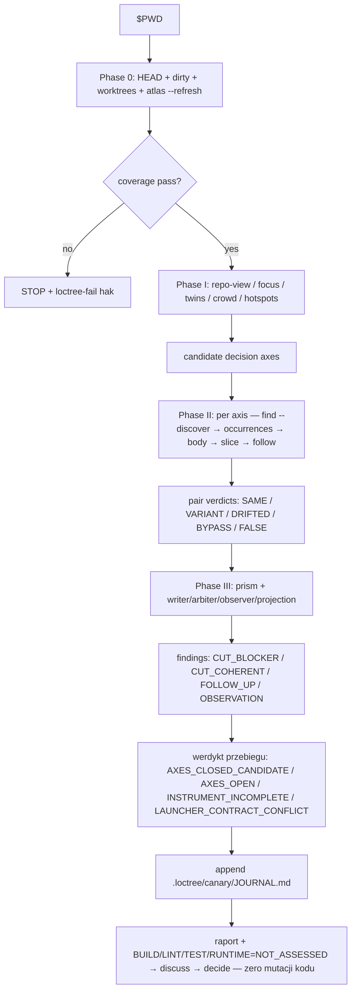

# Przepływ `vc-canary`

## Kontrakt faz

| Faza | Pytanie                                                     | Wyjście                                  |
| ---- | ----------------------------------------------------------- | ---------------------------------------- |
| 0    | Czy drzewo jest świeże i w pełni pokryte, z pokwitowaniami? | zapis HEAD/dirty/worktree + atlas        |
| I    | Które klasy prawdy mogą mieć >1 autora?                     | kandydackie osie decyzji                 |
| II   | Gdzie każda decyzja naprawdę żyje — udowodnione?            | werdykty par + falsyfikacja nieobecności |
| III  | Kto jest writerem / arbitrem / obserwatorem / projekcją?    | sklasyfikowane findingi + wynik prism    |
| QC   | Co decyduje operator?                                       | dopisany wpis journala + raport          |
