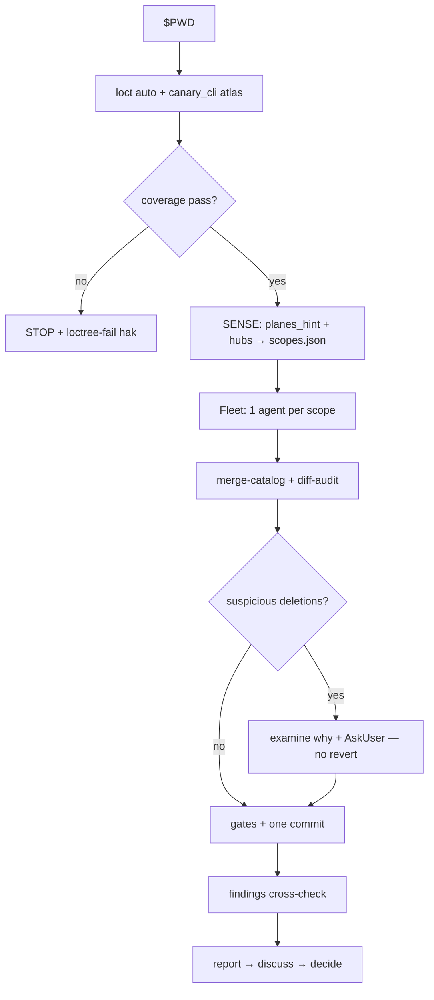

# `vc-canary` Flow

## Kontrakt faz

| Faza     | Pytanie                                 | Wyjście                          |
| -------- | --------------------------------------- | -------------------------------- |
| Atlas    | Czy inwentarz jest kompletny z receipt? | `.loctree/atlas/*`               |
| Sense    | Które planes?                           | `scopes.json` + briefy           |
| Fleet    | Czy każdy scope dowiózł katalog?        | `catalogs/<id>.json`             |
| Settle   | Czy można bezpiecznie commitować?       | jeden commit albo hold operatora |
| Findings | Co jest potwierdzonym sygnałem?         | `findings.json` + raport         |
