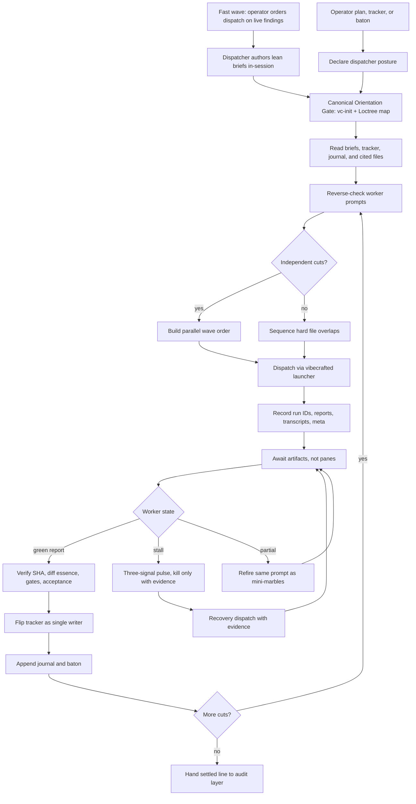

# `vc-dispatch` Flow

`vc-dispatch` prowadzi zewnętrzną linię floty Vibecrafted. To dyscyplina
dyspozytury: przygotuj linię, launchuj workerów przez framework, czekaj na trwałe
artefakty, weryfikuj raporty, flipnij ledger i nieś baton.

Nie staje się workerem.

## Flow

## Kontrakt faz

| Faza            | Pytanie dyspozytora                                            | Wymagane wyjście                           |
| --------------- | -------------------------------------------------------------- | ------------------------------------------ |
| Orientacja      | Czy mamy świeżą prawdę repo, runtime'u i intencji?             | evidence z `vc-init` i Loctree             |
| Przyjęcie wejść | Czy briefy, tracker, journal i cytowane pliki są pokryte?      | nota o pokryciu wejść                      |
| Prompting       | Czy worker może wykonać zadanie bez zgadywania?                | prompt czysty wg odwrotnej checklisty      |
| Kolejność fal   | Które cięcia mogą ruszyć równolegle na Living Tree?            | kolejność fal z notami o nakładaniu plików |
| Dispatch        | Czy każdy worker wystartował przez telemetrię frameworka?      | run ID, report, transcript, meta           |
| Await           | Czy każdy worker skończył, utknął (stall) czy padł z evidence? | stan artefaktu i evidence z pulsu          |
| Weryfikacja     | Czy raport workera zgadza się z briefem i zlądowanym diffem?   | SHA, esencja diffa, evidence z bramek      |
| Ledger          | Kto flipnął linię i dlaczego?                                  | flip trackera i wpis do journala           |
| Baton           | Co kolejne cięcie musi wiedzieć, zanim wystartuje?             | aktualizacja batona z bieżącą prawdą       |

## Trasy

| Wejście                                     | Argumenty               | Produkuje                                         | Wyjście            |
| ------------------------------------------- | ----------------------- | ------------------------------------------------- | ------------------ |
| `$vc-dispatch` w sesji                      | plan, tracker lub baton | postawa dyspozytora, kolejność fal, journal linii | zwraca handoff     |
| `vibecrafted dispatch <agent>`              | `--prompt` lub `--file` | artefakty runu zewnętrznego workera               | `0` przy dispatchu |
| `vibecrafted <workflow> <agent> --file ...` | plik briefu workera     | report, transcript, meta, opcjonalny commit SHA   | status komendy     |

### Krawędzie eskalacji

- Brak briefów lub trackera -> `vibecrafted scaffold <agent>`
- Strategia wciąż rozmyta -> `vibecrafted partner <agent>`
- Jeden slice potrzebuje dowiezienia od A do Z na własność -> `vibecrafted ownership <agent>`
- Kruchy partial potrzebuje presji zbieżności -> `vibecrafted marbles <agent>`
- Ukończona linia potrzebuje audytu dowodowego -> `vibecrafted followup <agent>`, `vibecrafted audit <agent>` lub `vibecrafted dou <agent>`

### Artefakty sesji

- Korzeń artefaktów: `$VIBECRAFTED_HOME/artifacts/<org>/<repo>/<YYYY_MMDD>/`
- Wyjścia workerów: `reports/<timestamp>_<slug>_<agent>.md` z pasującymi `.transcript.log` i `.meta.json`
- Ledger dispatchu: tracker i append-only journal należące do dyspozytora
- Locki: `$VIBECRAFTED_HOME/locks/<org>/<repo>/<run_id>.lock`

## Antywzorce

- Traktowanie załadowania skilla jako pozwolenia na self-dispatch bez prośby operatora.
- Stawanie się implementerem dla cięcia workera.
- Ponowne uruchamianie testów workera jako dyspozytor zamiast czytania reportu, SHA i hooków.
- Flipowanie `[~]` na `[x]` bez SHA, evidence z bramek i stanu acceptance.
- Zabijanie workera na jednym słabym sygnale zamiast wg reguły pulsu trójsygnałowego.
- Startowanie workerów szeregowo, gdy pliki są niezależne i dostępna jest fala równoległa.
