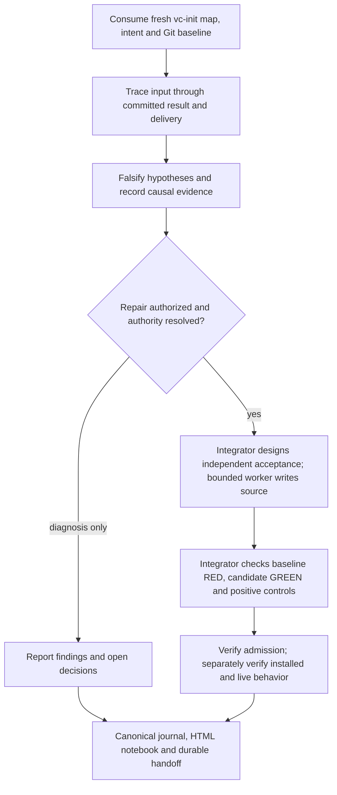

# `vc-forensics` Flow

- `/vc-forensics`: interaktywne śledztwo w tej sesji.
- `vibecrafted workflow <agent> --file <brief.md>`: bounded external workflow;
  brief explicitly loads this skill, respecting current role and compile embargo.
- Brak dedykowanego `vibecrafted forensics` launcher.

[SKILL.md](SKILL.md) owns the protocol. Read the
[evidence contract](references/forensics-evidence-spec.md) for causal proof,
[journal template](references/forensics-journal-template.md) for append-only
`<repo-root>/.vibecrafted/THE_JOURNAL.md`, and
[notebook contract](references/report-notebook.md) for offline HTML imports.
Końcowy raport workera, zielona bramka ani eksport notebooka nie dowodzą odbioru na żywo.
