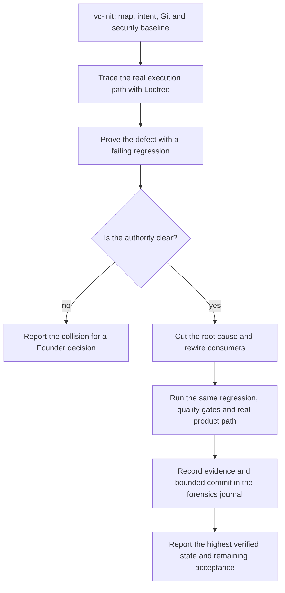

# `vc-forensics` Flow

## Flow

## Routes

| Entry                           | Args                             | Produces                                 | Exit             |
| ------------------------------- | -------------------------------- | ---------------------------------------- | ---------------- |
| `vibecrafted forensics <agent>` | `--prompt` or `--file`           | report, transcript, run metadata         | dispatch receipt |
| `/vc-forensics`                 | bounded investigation and repair | evidence, regression and authored commit | report           |

## Evidence and boundaries

[SKILL.md](SKILL.md) jest właścicielem protokołu. Użyj
[references/forensics-evidence-spec.md](references/forensics-evidence-spec.md)
dla formatu dowodów oraz
[references/forensics-journal-template.md](references/forensics-journal-template.md)
dla wpisów append-only w `./.loctree/forensics/JOURNAL.md`.

- Przypnij baseline i przeczytaj `slice` / `impact` przed zmianą właściciela źródłowego.
- Ta sama regresja musi być czerwona przed naprawą i zielona po niej.
- Niejednoznaczny właściciel wymaga decyzji Foundera; nie dodawaj kolejnego.
- Bramki repo nie dowodzą runtime, instalacji ani dostarczenia. Każdą powierzchnię
  akceptacji opisz na rzeczywiście zweryfikowanym poziomie.
- Stage obejmuje tylko ograniczony cut. Integracja, instalacja i release podlegają
  upoważnieniu bieżącego runu i granicom kanonicznego skilla.
