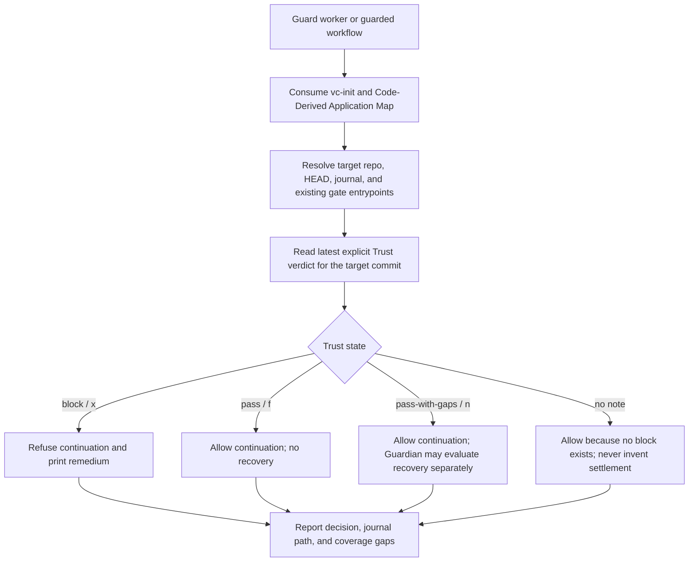

# `vc-guard` Flow — egzekwuj, nigdy nie osądzaj

`vc-guard` konsumuje prawdę Trustu. Nie wyprowadza werdyktu i nie pisze
settlementu f/x/n.

## Flow

## Kontrakt decyzyjny

| Prawda Trustu       | Settlement | Decyzja Guarda | Recovery Guardiana                |
| ------------------- | ---------- | -------------- | --------------------------------- |
| `pass`              | `f`        | przepuść       | terminalne; nie wznawiaj          |
| `pass-with-gaps`    | `n`        | przepuść       | osobno kwalifikowalne wg polityki |
| `block`             | `x`        | odmów          | terminalne; nie wznawiaj          |
| brak jawnej notatki | brak       | przepuść       | nie ma settlementu do odzyskania  |

Recovery Guardiana to osobna władza runtime'u. `n` można wznowić wyłącznie przez
jego natywny adapter, klucz idempotencji i budżet automatycznych prób. Sam Guard
nigdy nie woła resume i nigdy nie zamienia decyzji „przepuść" w trust pass.

## Trasy

| Wejście                                              | Czyta                                            | Produkuje                                |
| ---------------------------------------------------- | ------------------------------------------------ | ---------------------------------------- |
| `vibecrafted guard <agent> --prompt ...`             | mapę repo, powierzchnie bramek, trust journal    | inwentarz/raport workera                 |
| `python -m vibecrafted_core.guard inventory`         | zainstalowane i repozytoryjne entrypointy bramek | nazwany inwentarz bramek + uczciwe luki  |
| `python -m vibecrafted_core.guard check`             | HEAD + najnowszy wpis journala                   | status wyjścia przepuść/odmów + remedium |
| `python -m vibecrafted_core.guard check --sha <sha>` | nazwany commit + najnowszy wpis journala         | status wyjścia przepuść/odmów + remedium |

## Twarde granice

- Kontynuację odmawia wyłącznie jawny Trust `block`.
- Brak osądu nie jest po cichu awansowany ani na pass, ani na block.
- Guard nie falsyfikuje twierdzeń, nie pisze notatek trustu, nie pisze
  settlementów i nie zmienia kodu w repozytorium.
- Każda odmowa wskazuje journal oraz ścieżkę ponownego zbadania / ponownego
  zanotowania.
