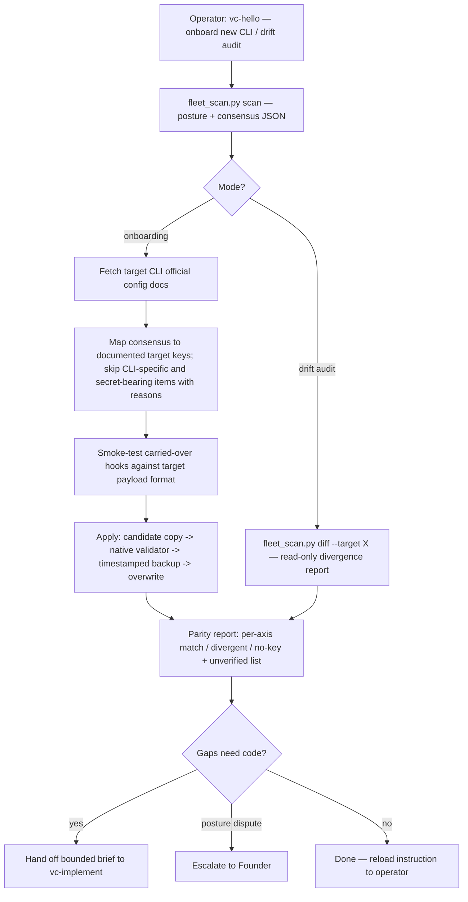

# `vc-hello` Flow

## Flow

## Routes

| Entry                   | Args                                       | Produces                                  | Exit                     |
| ----------------------- | ------------------------------------------ | ----------------------------------------- | ------------------------ |
| `vc-hello` (in-session) | nazwa CLI celu lub "drift <cli>"           | posture.json + raport parity / drift.json | `0` po zapisaniu raportu |
| `fleet_scan.py scan`    | `--output FILE`                            | postawa floty + konsensus JSON            | `0` / `1` przy błędzie   |
| `fleet_scan.py diff`    | `--target CLI --output FILE [--posture F]` | raport dryfu każdej osi                   | `0` / `1` przy błędzie   |

### Escalation edges

- Brak skryptu hooka / serwera MCP, który trzeba zbudować → `vc-implement`.
- Konflikt postawy floty bez większości (2:2) → decyzja Foundera zapisana w raporcie.
- Onboarding człowieka szerszy niż konfiguracja → `references/onboarding-stack.md` + skill vibecraftsmanship.
