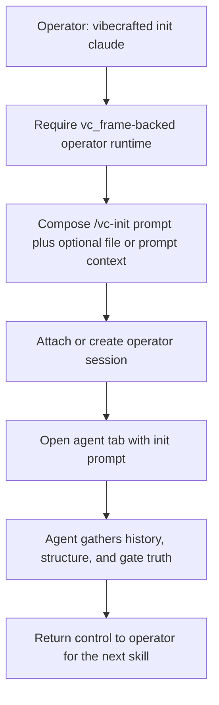

# Przepływ `vc-init`

## Flow

## Trasy

| Wejście                    | Argumenty                                                      | Produkuje                                       | Wyjście            |
| -------------------------- | -------------------------------------------------------------- | ----------------------------------------------- | ------------------ |
| `vibecrafted init <agent>` | opcjonalne `--prompt` lub `--file`; tylko interaktywny runtime | karta/sesja operatora plus handoff promptu init | `0` przy dispatchu |
| `vc-init <agent>`          | to samo                                                        | to samo                                         | `0` przy dispatchu |

### Krawędzie eskalacji

- Następne w kolejce planowanie -> `vibecrafted scaffold <agent>` lub `workflow`
- Potrzebne wspólne sterowanie -> `vibecrafted partner <agent>`
- Następne w kolejce ship WRITE -> `vibecrafted implement <agent>`
- Postawa Just Do (typ z promptu) -> `vibecrafted justdo <agent>` (nie alias implement)

### Artefakty sesji

- Sesja operatora: sesja vc_frame nazwana od bazy repo lub odziedziczona z kontekstu przebiegu (run context)
- Lock: samo `vc-init` nie gwarantuje nowego locka; dalsze skille tworzą go lub dziedziczą
- Wyjścia: zespawnowana sesja agenta zapisuje taki raport, transkrypt i meta, jakie produkuje następny workflow
