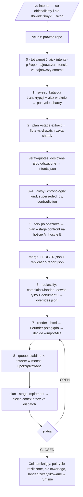

# Przepływ `vc-intents`

## Flow

## Trasy

| Wejście                                   | Argumenty                                        | Produkuje                                               | Wyjście               |
| ----------------------------------------- | ------------------------------------------------ | ------------------------------------------------------- | --------------------- |
| `/vc-intents`                             | okno (`--since/--until` albo temat), repo z cwd  | workdir z ledgerem, kolejką, planami, stroną przeglądu  | interaktywnie         |
| `vibecrafted intents <agent>`             | jeden tor: JSON sharda albo toru, ścieżka briefu | `<shard>.json` albo `<tor>.verdicts.json`, raport       | `0` po dispatchu      |
| `intents_cli.py <workdir> plan --stage …` | `extract` · `confront` · `implement`             | plan `vibecrafted.dispatch.v1` pod `<artifacts>/plans/` | `0`                   |
| `intents_cli.py <workdir> status`         | —                                                | liczniki, powody otwarcia                               | `0` CLOSED · `1` OPEN |

### Krawędzie eskalacji

- Dwa moduły konkurują o prawdę, której intencja potrzebuje → `vibecrafted canary <agent>` (potwierdź w kodzie; canary nigdy nie refaktoruje)
- Kolejka zapisana → `vibecrafted dispatch <intents-implement.*.dispatch.toml>` (domyślnie codex)
- Worker twierdzi, że cięcie wylądowało → `vibecrafted trust <agent>`, zanim ledger powie `landed`
- Sprzeczność dwu wypowiedzi Foundera → `aicx clarify`, potem Founder
- Wejściem jest spisany plan, nie korpus → `vibecrafted audit <agent>`

### Artefakty sesji

- Workdir: `~/.vibecrafted/artifacts/<owner>/<repo>/intents/` — `sweep.json`, `shards/`, `intents.json`,
  `lanes/`, `LEDGER.json`, `LEDGER.md`, `overrides.jsonl`, `replication-report.json`, `queue.json`,
  `STABLE-QUEUE.md`, `intents.html`
- Plany: `~/.vibecrafted/artifacts/<owner>/<repo>/<RRRR_MMDD>/plans/intents-{extract,confront,implement}.<host>.dispatch.toml`
- Werdykty floty: `<artifacts>/reports/verdicts-<host>/<tor>.verdicts.json`
- Haki narzędzi: `~/.vibecrafted/loctree/loctree-fail.md`, `~/.vibecrafted/aicx/aicx-fail.md` — append-only; hak to twierdzenie o narzędziu, potwierdź zanim dopiszesz

### Powrót po cięciu lub kompakcji

`status` → przeczytaj `LEDGER.md` → `queue` → `plan --stage implement`. Nie
powtarzaj sweepu ani ekstrakcji; oba są na dysku i drogie.
