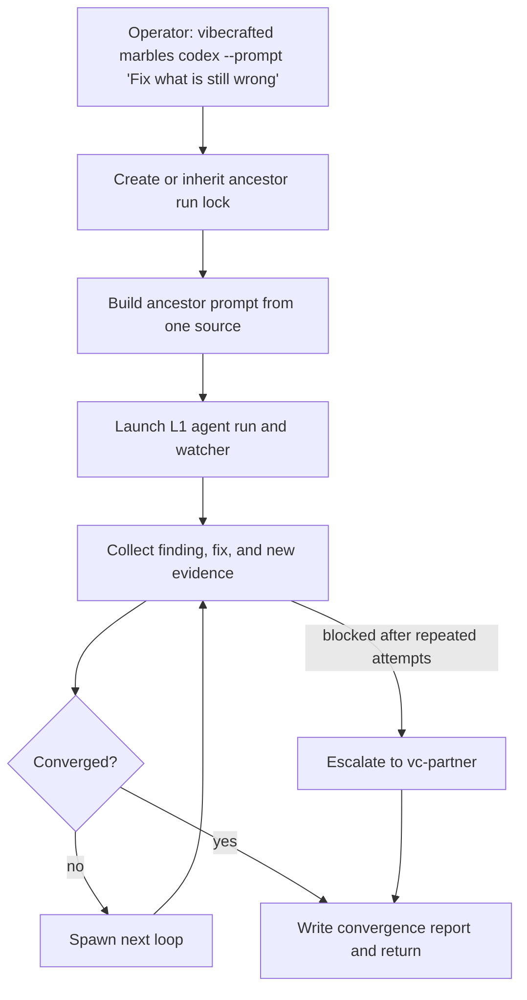

# `vc-marbles` Flow

## Flow

## Trasy

| Wejście                                                             | Argumenty                                                                   | Produkuje                                                              | Wyjście                    |
| ------------------------------------------------------------------- | --------------------------------------------------------------------------- | ---------------------------------------------------------------------- | -------------------------- |
| `vibecrafted marbles <agent>`                                       | dokładnie jeden z `--prompt`, `--file` lub `--depth`; opcjonalnie `--count` | raport ancestora plus raporty pętli, transkrypty i meta pod `marbles/` | `0` przy launchu           |
| `vc-marbles <agent>`                                                | tak samo                                                                    | tak samo                                                               | `0` przy launchu           |
| `vibecrafted marbles pause\|stop\|resume\|session\|inspect\|delete` | argumenty sterujące                                                         | akcje sterujące runtime'em marbles                                     | `0` przy udanym sterowaniu |

Po dispatchu od razu uzbrój `vibecrafted <agent> await --run-id <id>` po stronie
supervisora. JSON control plane'u, pliki raportów, transkrypty, pane'y i
zaplanowane wybudzenia są wyłącznie diagnostyczne — to nie są sygnały wybudzenia.
Hedge'owanie awaita doraźnymi pollerami/watcherami to naruszenie Class 3; napraw
`control_plane.await_run`, nie normalizuj hedge'a. Zobacz `docs/runtime/AGENT_OPS.md`.

Liveness na 3 sygnałach: verdict awaita, terminalne meta runu, martwy pid workera,
plus obecność obiecanego raportu. Dwa zgodne sygnały wystarczą, żeby działać, trzy —
żeby ogłosić done; każda niezgodność oznacza traktuj jako żywy i uzbrój await
ponownie. Znany skew: rc=0 przy żywym runie i meta zawieszone na `active`/`stalled`
po faktycznym zakończeniu.

### Krawędzie eskalacji

- Ten sam blocker utrzymuje się po wielu pętlach -> `vibecrafted partner <agent>`
- Pozostała luka jest szersza niż zbieżność -> `vibecrafted ownership <agent>`
- Operator chce auditu zamiast kolejnych pętli -> `vibecrafted followup <agent>`

### Artefakty sesji

- Korzeń artefaktów: `$VIBECRAFTED_HOME/artifacts/<org>/<repo>/<YYYY_MMDD>/marbles/`
- Lock: `$VIBECRAFTED_HOME/locks/<org>/<repo>/<run_id>.lock`
- Outputy: raporty ancestora, raporty pętli, raporty zbieżności, transkrypty oraz sidecary `.meta.json` pod `marbles/reports/`
