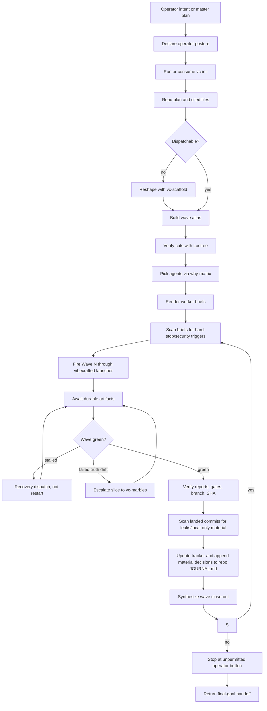

# `vc-operator` Flow

`vc-operator` to autonomiczna postawa orkiestracji dla zaplanowanego
wielofalowego łańcucha dispatchów.

Dyryguje. Nie staje się workerem.

## Pętla rdzeniowa

## Kontrakt fazy

| Faza               | Pytanie                                                    | Wymagany output                        |
| ------------------ | ---------------------------------------------------------- | -------------------------------------- |
| Postawa            | Czy jawnie weszliśmy w tryb operatora?                     | jednoliniowe przesunięcie framingu     |
| Orientacja         | Czy mamy bieżącą prawdę repo/runtime'u/intencji?           | evidence `vc-init`                     |
| Przyjęcie planu    | Czy cały plan i każdy cytowany plik są przeczytane?        | nota pokrycia wejścia                  |
| Dispatchowalność   | Czy plan da się odpalić jako fale?                         | wave atlas lub handoff scaffoldu       |
| Weryfikacja cięcia | Czy każde cięcie pasuje do struktury repo?                 | adnotacje Loctree                      |
| Dobór agentów      | Kto powinien odpalić każdy slice?                          | uzasadnienie z why-matrix              |
| Briefing           | Czy worker może wykonać bez zgadywania?                    | wyrenderowany brief dispatchu          |
| Skan briefu        | Czy prompt zawiera triggery hard-stop/bezpieczeństwa?      | nota ze skanu lub odmowa               |
| Dispatch           | Czy każdy spawn poszedł przez telemetrię frameworka?       | run ID, tracker, stan wyniku           |
| Await              | Czy każdy worker skończył, zaciął się czy padł z evidence? | stan raportu/transkryptu/meta          |
| Odzyskiwanie       | Czy następne działanie jest celowane, a nie ślepym retry?  | brief odzyskiwania lub eskalacja       |
| Skan commita       | Czy commity workera wyciekły dane lokalne lub wrażliwe?    | nota ze skanu lub oczyszczony recommit |
| Zamknięcie         | Co wylądowało i gdzie?                                     | raport fali, SHA, bramki               |
| Stop               | Co pozostaje niedozwolone/należące do operatora?           | handoff finalnego celu                 |

## Dziennik operatora

Tryb operatora utrzymuje dwie różne powierzchnie prawdy:

- datowane trackery/raporty pod `$VIBECRAFTED_HOME/artifacts/...` - stan runu,
  run ID, gałęzie, SHA, bramki, transkrypty i metadane.
- `<repo-root>/.vibecrafted/JOURNAL.md` - jeden stały, append-only, śledzony
  przez Git Dziennik Operatora.

Tracker pozwala operatorowi zaudytować, co wylądowało, bez czytania każdego raportu.
Dziennik wyjaśnia, dlaczego fala poruszyła się tak, jak się poruszyła.
Mutacje planu, decyzje o odkrytych poprawkach, integracje i incydenty na
guardrailach bezpieczeństwa to wpisy do dziennika, a nie wyjaśnienia istniejące
tylko w pamięci. Datowane artefakty to projekcje evidence, nigdy alternatywne
kanoniczne dzienniki. Tylko Operator pisze do dziennika; Workerzy przekazują
falsyfikowalne findingi i pozostają wewnątrz briefów.

## Trasy

| Wejście                            | Argumenty                                                          | Produkuje                                                      | Wyjście        |
| ---------------------------------- | ------------------------------------------------------------------ | -------------------------------------------------------------- | -------------- |
| `$vc-operator` w sesji             | plan lub mandat w kontekście                                       | postawa, wave atlas, briefy, zadziennikowane decyzje           | zwraca handoff |
| `vibecrafted dispatch <file.toml>` | flagi manifestu, np. `--doctor`, `--dry-run`, `--json`, `--resume` | deterministyczne artefakty walidacji/wyniku/trackera dispatchu | status komendy |
| `vibecrafted dispatch run ...`     | run id, root, ścieżki report/transcript, komenda workera           | asynchroniczny stan cyklu życia jednego workera                | status komendy |

### Krawędzie eskalacji

- Najpierw potrzebny plan -> `vibecrafted scaffold <agent>`
- Potrzebna wspólna strategia przed dispatchem -> `vibecrafted partner <agent>`
- Slice wymaga solowego dowiezienia od A do Z -> `vibecrafted ownership <agent>`
- Fala padła na dryfie prawdy -> `vibecrafted marbles <agent>`
- Ukończony łańcuch potrzebuje powierzchni release'u -> `vibecrafted release <agent>`

### Artefakty sesji

- Korzeń artefaktów: `$VIBECRAFTED_HOME/artifacts/<org>/<repo>/<YYYY_MMDD>/`
- Stan trackera/wyniku: pliki specyficzne dla dispatchu pod korzeniem artefaktów runu
- Kanoniczny dziennik: `<repo-root>/.vibecrafted/JOURNAL.md`
- Briefy/zamknięcia: datowane projekcje runu zarządzane przez operatora
- Lock: `$VIBECRAFTED_HOME/locks/<org>/<repo>/<run_id>.lock`

## Antywzorce

- Zachowywanie się jak implementer zamiast dyrygenta.
- Ponowne odpalanie zaciętej fali bez czytania raportu padłego workera.
- Kompresowanie statusu fali do „green" bez SHA i evidence bramek.
- Traktowanie natywnych subagentów jako zewnętrznych dispatchów floty.
- Przypisywanie osiągnięć workera jako osiągnięć operatora.
- Osobiste implementowanie odkrytej sąsiedniej poprawki zamiast podjęcia
  decyzji, stworzenia briefu, dispatchu do dedykowanego worktree, weryfikacji i
  integracji.
- Wypełnianie dziennika lub handoffu rutynowymi twierdzeniami o pracy niewykonanej.
- Kontynuowanie poza niedozwolonym operator button.
