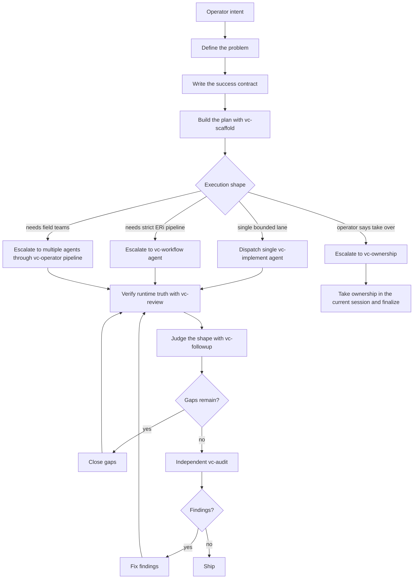

# `vc-partner` Flow

`vc-partner` to kolaboracyjny kręgosłup dowiezienia.

To nie słabsze `vc-ownership`. Ownership znaczy „przejmij ster i prowadź dalej".
Partner znaczy „trzymamy mózg sterujący współdzielony, podczas gdy agent wykonuje
ciężką pracę, zbiera evidence i zamienia decyzje w dowieziony kształt".

## Pętla rdzeniowa



## Kontrakt fazy

| Faza             | Pytanie                                             | Wymagany output                                              |
| ---------------- | --------------------------------------------------- | ------------------------------------------------------------ |
| Zdefiniuj        | Jaki problem naprawdę rozwiązujemy?                 | opis problemu, scope, non-goals                              |
| Kontrakt sukcesu | Skąd będziemy wiedzieć, że kształt jest dobry?      | kryteria akceptacji, bramki, dowód runtime'u                 |
| Plan             | Jaka jest najmniejsza wiarygodna ścieżka wykonania? | uporządkowany plan, checkpointy, reguła eskalacji            |
| Wykonaj          | Kto robi pracę i gdzie?                             | bezpośrednie edycje, przebieg workflow lub zdelegowane plany |
| Zweryfikuj       | Co jest prawdą na żywej powierzchni / w runtimie?   | logi bramek, wyniki smoke'u, zaobserwowane zachowanie        |
| Review kształtu  | Czy wynik rozwiązał pierwotny problem?              | noty match/mismatch, zmienione założenia                     |
| Domknięcie luk   | Co wciąż uniemożliwia spełnienie obietnicy?         | domknięte luki lub jawnie zablokowana granica                |
| Niezależny audyt | Co wychwyciłby świeży recenzent?                    | raport auditu, findingi uszeregowane wg severity             |
| Findingi         | Które findingi trzeba naprawić przed dowiezieniem?  | fixy, odroczenia z uzasadnieniem, re-checki                  |
| Dowiezienie      | Czy to gotowe do handoffu lub publikacji?           | commit/raport/release notes/następny ruch                    |

## Głębokość partnera

| Tryb               | Użyj, gdy                                                             | Kształt                                                                                                                     |
| ------------------ | --------------------------------------------------------------------- | --------------------------------------------------------------------------------------------------------------------------- |
| `partner-light`    | Problem jest mały, a operator chce wspólnego myślenia.                | zdefiniuj -> plan -> wykonaj -> zweryfikuj -> dowieź                                                                        |
| `partner-standard` | Praca zmienia zachowanie lub powierzchnię produktu.                   | zdefiniuj -> plan -> wykonaj -> review kształtu -> luki -> audyt -> dowieź                                                  |
| `partner-heavy`    | Powierzchnia obejmuje systemy, agentów, runtime lub ryzyko release'u. | zdefiniuj -> plany wielotorowe -> zdelegowane wykonanie -> review kształtu -> marbles/audyt -> findingi -> bramka release'u |

Domyślnie stosuj `partner-standard`, chyba że operator jawnie zawęzi lub poszerzy
przepływ.

## Reguły decyzji

- Pozostań w `vc-partner`, dopóki operator chce wspólnego sterowania.
- Eskaluj do `vc-ownership`, gdy operator mówi, by wziąć odpowiedzialność i
  przestać sprawdzać przy każdej turze.
- Eskaluj do `vc-workflow`, gdy plan wymaga formalnej struktury Examine -> Research ->
  Implement.
- Eskaluj do `vc-agents`, gdy niezależna praca polowa materialnie poprawia
  odpowiedź.
- Eskaluj do `vc-marbles`, gdy luki P0/P1 pozostają po implementacji.

## Kadencja odczyt-zapis

Po każdym workflow „write": `vc-implement`, `vc-workflow`, `vc-marbles`,
`vc-polarize` powinny nastąpić przebiegi percepcji tylko-do-odczytu:
`vc-review`, `vc-followup`, `vc-audit` oraz `vc-dou` - finalne
sprawdzenie Definition of Undone przed release'em.

Nie ogłaszaj, że task jest skończony, zanim przejdzie sprawdzenie „Definition of Undone".

## Checkpointy

Każdy nietrywialny przebieg `vc-partner` powinien zostawić te checkpointy w raporcie
lub metadanych runu:

```yaml
problem:
  statement: ""
  scope: []
  non_goals: []
success_contract:
  acceptance: []
  gates: []
  runtime_proof: []
plan:
  steps: []
  escalation_rule: ""
execution:
  mode: direct | vc-workflow | vc-agents | vc-ownership
  artifacts: []
shape_review:
  matches_original_problem: true
  mismatches: []
gaps:
  closed: []
  remaining: []
audit:
  auditor: ""
  findings: []
ship:
  commit: ""
  report: ""
  release_or_next_move: ""
```

## Dziennik partnera

`vc-partner` jest właścicielem pierwotnego kształtu przez compaction, delegację, review i
audyt. Trwałą pamięcią tej odpowiedzialności jest dziennik partnera: pojedynczy
dziennik misji tylko-do-dopisywania, wzorowany na trackerze operatora.

Dziennik to nie wypolerowany raport. To bieżący rejestr, który zapobiega
dryfowi wizji, ukrytym zmianom założeń i pokompaktowym pomyłkom.

### Ścieżka dziennika

- Korzeń artefaktów: `$VIBECRAFTED_HOME/artifacts/<org>/<repo>/<YYYY_MMDD>/partner/`
- Dziennik: `<artifact-root>/journal.md`
- Raporty: `<artifact-root>/reports/<timestamp>_<slug>_partner.md`
- Transkrypty/meta: dopasowane `.transcript.log` i `.meta.json`

### Reguły dziennika

- Tylko do dopisywania. Nigdy nie przepisuj wcześniejszych wpisów, by historia wyglądała czyściej.
- Pierwszy wpis uchwyca `original_shape` przed rozpoczęciem wykonania.
- Każdy handoff, compaction, zdelegowany run, finding i zmiana kształtu dostaje
  wpis.
- Korekty zapisuje się jako nowe wpisy: „poprzedni model był X; obecny model
  to Y, ponieważ evidence Z".
- Dryf kształtu jest dozwolony tylko wtedy, gdy zostanie jawnie nazwany jako decyzja, z evidence
  runtime'u lub aprobatą operatora.
- Raporty mogą podsumowywać dziennik, ale to dziennik pozostaje pamięcią misji.

### Kształt wpisu

```md
## <timestamp> - <phase>

- State: what is true now
- Shape check: faithful | drifting | intentionally changed
- Evidence: commands, reports, runtime observations, links
- Decision: what changed in the plan or contract
- Next: the next bounded move
```

### Wpis pierwotnego kształtu

```yaml
original_shape:
  problem: ""
  promise: ""
  target_user_or_operator: ""
  invariants: []
  non_goals: []
  success_contract: []
  accepted_drift_policy: "only with explicit journal entry"
```

## Trasy

| Wejście                       | Argumenty                           | Produkuje                                    | Wyjście                        |
| ----------------------------- | ----------------------------------- | -------------------------------------------- | ------------------------------ |
| `vibecrafted partner <agent>` | opcjonalny seed `--prompt`/`--file` | interaktywna twarz TTY/frame z `/vc-partner` | `0` przy interaktywnym starcie |
| `vc-partner` z TTY            | nic wymaganego                      | skill w aktywnej sesji                       | `0`                            |
| `vc-partner` bez TTY          | dowolne                             | odmowa (najpierw `vc-init`, potem skill)     | `1`                            |

### Krawędzie eskalacji

- Małe bounded cięcie w tej samej sesji -> bezpośrednia implementacja lub `vc-delegate`
- Osobne jednostki wykonawcze -> `vc-agents`
- Formalny lane inspect/research/implement -> `vc-workflow`
- Przejęcie autonomicznego dowiezienia -> `vc-ownership`
- Domknięcie luk wykrytych podczas `vc-followup`: `vc-marbles`
- Redukcja entropii po `vc-marbles`: `vc-audit` -> `vc-polarize`
- Finalna powierzchnia release'u -> `vc-release`

### Artefakty sesji

- Korzeń artefaktów: `$VIBECRAFTED_HOME/artifacts/<org>/<repo>/<YYYY_MMDD>/partner/`
- Dziennik: `<artifact-root>/journal.md`
- Lock: `$VIBECRAFTED_HOME/locks/<org>/<repo>/<run_id>.lock`
- Outputy: `reports/<timestamp>_<slug>_<agent>.md` z dopasowanym
  `.transcript.log` i `.meta.json`

## Antywzorce

- Przekształcanie Partnera w cichy Ownership.
- Proszenie plannerów, by zdefiniowali za nas problem.
- Implementowanie, zanim istnieje kontrakt sukcesu (success contract).
- Ogłaszanie pracy za skończoną przed review kształtu.
- Traktowanie findingów z auditu jako opcjonalnej dekoracji.
- Dowiezienie bez świeżego evidence bramek.
