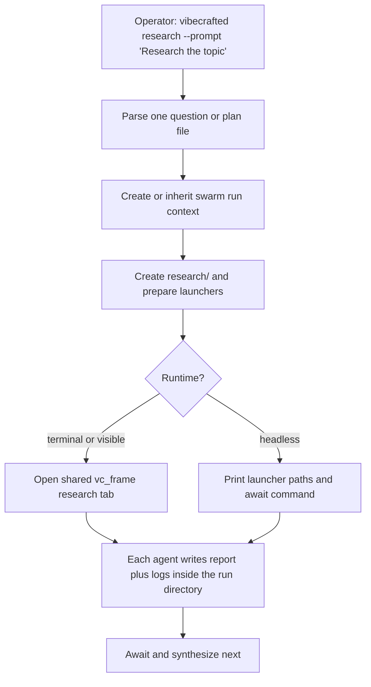

# `vc-research` Flow

## Flow

## Trasy

| Wejście                                    | Argumenty     | Produkuje                           | Wyjście            |
| ------------------------------------------ | ------------- | ----------------------------------- | ------------------ |
| `vibecrafted research --prompt <text>`     | pytanie       | uruchomienie swarmu + kontekst runu | `0` przy dispatchu |
| `vibecrafted research --file <plan.md>`    | plik planu    | to samo                             | `0` przy dispatchu |
| `vibecrafted research await --run-id <id>` | selektor runu | wyjście await/summary               | `0` przy odczycie  |
| `vc-research --prompt\|--file`             | to samo       | to samo                             | `0` przy dispatchu |

### Krawędzie eskalacji

- Research skończony i zespół chce plan -> `vibecrafted scaffold <agent>`
- Research skończony i ma ruszyć wykonanie -> `vibecrafted workflow <agent>` lub `implement` (ship WRITE); postawa na pierwszym miejscu -> `justdo`
- Research potrzebuje jednego silnego ownera zamiast swarmu -> `vibecrafted <agent> research <plan.md>`

### Artefakty sesji

- Root artefaktów: `$VIBECRAFTED_HOME/artifacts/<org>/<repo>/<YYYY_MMDD>/research/<run_id>/`
- Lock: `$VIBECRAFTED_HOME/locks/<org>/<repo>/<run_id>.lock`
- Powierzchnia dla człowieka: `summary.md` plus `reports/{claude,codex,gemini}.md`
- Audyt wewnętrzny: `logs/{claude,codex,gemini}.meta.json`, transkrypty, surowe strumienie, prompty runtime'u, launchery i layout pod `logs/` i `tmp/`
