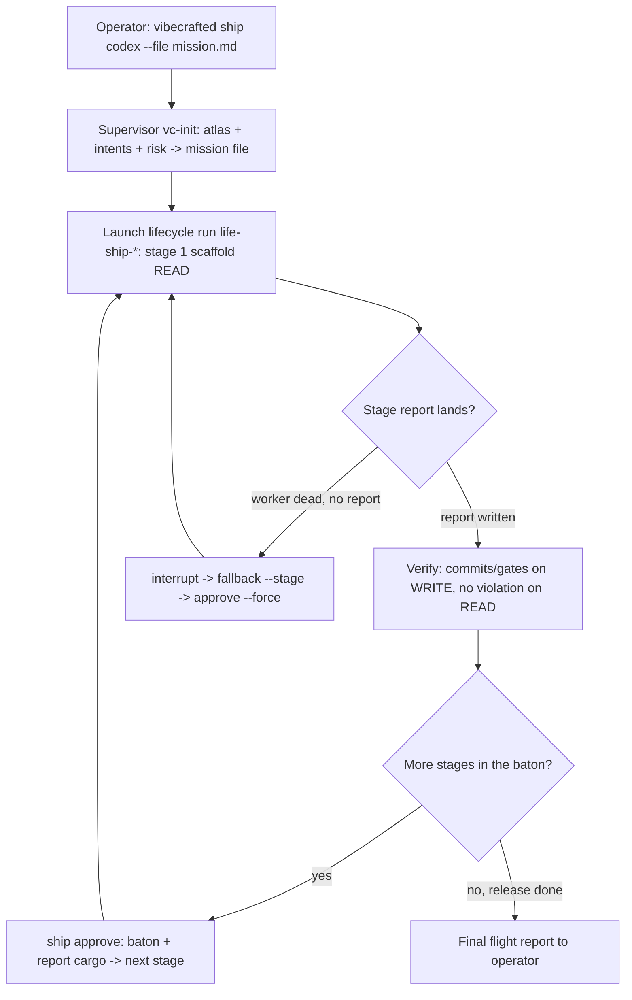

# `vc-ship` Flow

## Flow

## Trasy

| Wejście                    | Argumenty                                   | Produkuje                                                           | Wyjście            |
| -------------------------- | ------------------------------------------- | ------------------------------------------------------------------- | ------------------ |
| `vibecrafted ship <agent>` | `--prompt` albo `--file`, `[--start-stage]` | katalog runu cyklu życia (`state.json`, transcript), raporty etapów | `0` przy dispatchu |
| `vc-ship <agent>`          | to samo                                     | to samo                                                             | `0` przy dispatchu |

### Krawędzie eskalacji

- Misja nie ma jeszcze osadzonego planu → najpierw `vibecrafted scaffold <agent>`,
  potem podaj plik planu do `vc-ship` jako misję.
- Potrzebne jest tylko jedno cięcie dowozowe → `vibecrafted implement <agent>` /
  `vc-justdo`; parasol to przerost dla pojedynczej zmiany o znanym kształcie.
- Decyzje sterujące wychodzą poza stałe mandaty (publikacja, merge, wydatek) →
  zatrzymaj się i wyłóż sprawę człowiekowi-operatorowi; `vibecrafted partner <agent>`
  do wspólnego sterowania.

### Artefakty sesji

- Root artefaktów: `$VIBECRAFTED_HOME/artifacts/<org>/<repo>/<YYYY_MMDD>/`
- Run cyklu życia: `$VIBECRAFTED_HOME/control_plane/lifecycle_runs/<run_id>/state.json`
- Wyjścia: `reports/<stage>/…_report.md` per etap, wraz z odpowiadającymi
  transcriptami i metą w katalogach runów runtime'u

### Antywzorce

- Pilnowanie bramek etapów z wnętrza subagenta (gate-nap, AGENT_OPS.md klasa 1)
  — watchery mieszkają przy nadzorcy.
- Wysiadywanie budżetu etapu przy martwym workerze zamiast sprawdzenia
  `status --json` → `stage_worker.worker_dead_without_report` (klasa 2).
- Zatwierdzanie na podstawie ciszy: raport nieprzeczytany, commity
  niezweryfikowane, guzik niewciśnięty.
