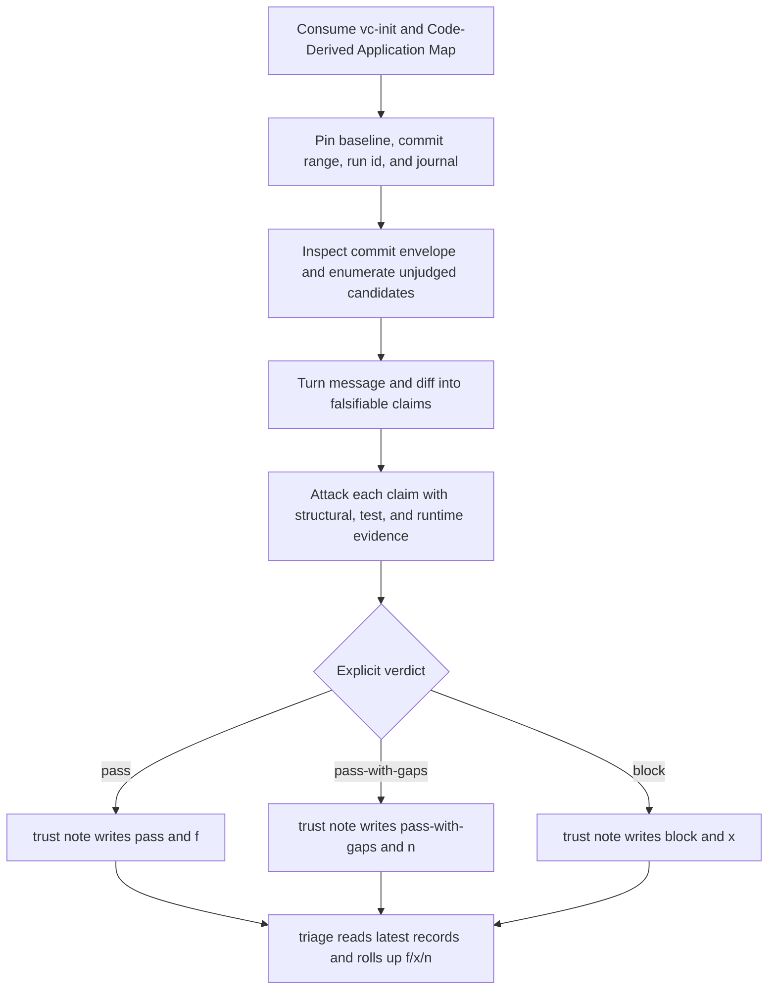

# `vc-trust` Flow — falsyfikuj, zanotuj, zrzutuj

`vc-trust` osądza jawne claimy commitów po fakcie. Trwały osąd zapisuje i rzutuje
na f/x/n wyłącznie `trust note`.

## Flow

## Kontrakt werdyktu

| Werdykt          | Settlement | Znaczenie                        | Zachowanie downstream                                           |
| ---------------- | ---------- | -------------------------------- | --------------------------------------------------------------- |
| `pass`           | `f`        | claimy przetrwały mocne evidence | Guard przepuszcza; Guardian traktuje to jako terminalne         |
| `pass-with-gaps` | `n`        | zostają nazwane luki w evidence  | Guard przepuszcza; Guardian może spróbować ograniczonego resume |
| `block`          | `x`        | materialny claim padł            | Guard odmawia; Guardian traktuje to jako terminalne             |

Mechanika recovery należy do Guardiana, nie do Trustu. `n` pozostaje osądem
nawet wtedy, gdy Guardian wykona później jedno idempotentne natywne resume;
Trust nigdy tego resume nie odpala i nigdy nie przepisuje werdyktu tylko
dlatego, że proces wystartował ponownie.

## Trasy

| Wejście                                                 | Zmienia trwałą prawdę? | Po co                                                 |
| ------------------------------------------------------- | ---------------------- | ----------------------------------------------------- |
| `vibecrafted trust <agent> --prompt ...`                | tylko raport           | odpalić ograniczonego workera Trustu                  |
| `python -m vibecrafted_core.trust inspect <sha>`        | nie                    | mechanicznie wyciągnąć fakty o commicie               |
| `python -m vibecrafted_core.trust enumerate <author>`   | nie                    | wylistować nieosądzone commity kandydujące            |
| `python -m vibecrafted_core.trust await-primary <run>`  | nie                    | poczekać na granicę runu, potem wylistować kandydatów |
| `python -m vibecrafted_core.trust note <sha> <verdict>` | **tak**                | dopisać wpis do journala i jawny settlement           |
| `python -m vibecrafted_core.trust triage`               | nie                    | zebrać najnowszą prawdę z journala w f/x/n            |

## Granica evidence i zapisu

- `inspect`, `enumerate`, `await-primary`, status wyjścia i obecność raportu
  nigdy nie oznaczają passa i nigdy nie zapisują settlementu.
- Każdy materialny claim niesie ocenę evidence; mocnego `pass` nie da się
  zapracować samą legalnością wiadomości.
- Trust nigdy nie edytuje kodu, nie amenduje ani nie rewertuje commitów, nie
  blokuje dispatchu, nie pushuje i nie merguje.
- Guard jest czytelnikiem egzekwującym; Guardian jest ograniczonym runtime'em
  recovery.
