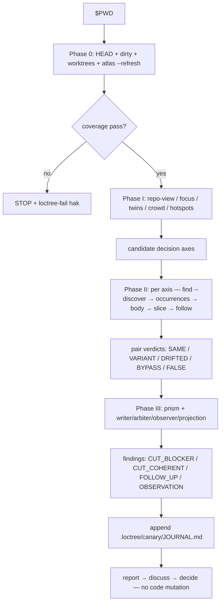

# `vc-canary` Flow

## Phase contract

| Phase | Question                                            | Output                                |
| ----- | --------------------------------------------------- | ------------------------------------- |
| 0     | Is the tree fresh and fully covered, with receipts? | HEAD/dirty/worktree record + atlas    |
| I     | Which classes of truth might have >1 author?        | candidate decision axes               |
| II    | Where does each decision actually live — proven?    | pair verdicts + absence falsification |
| III   | Who is writer / arbiter / observer / projection?    | classified findings + prism score     |
| QC    | What does the operator decide?                      | appended journal entry + report       |
