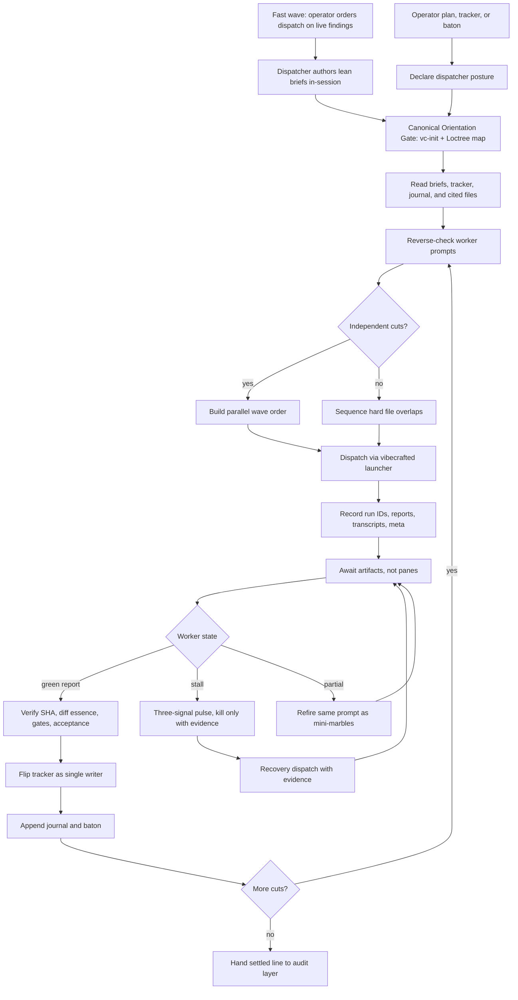

# `vc-dispatch` Flow

`vc-dispatch` conducts an external Vibecrafted fleet line. It is the
dyspozytura discipline: prepare the line, launch workers through the framework,
await durable artifacts, verify reports, flip the ledger, and carry the baton.

It does not become the worker.

## Flow

## Phase Contract

| Phase        | Dispatcher question                                     | Required output                    |
| ------------ | ------------------------------------------------------- | ---------------------------------- |
| Orientation  | Do we have fresh repo, runtime, and intention truth?    | `vc-init` and Loctree evidence     |
| Intake       | Are briefs, tracker, journal, and cited files covered?  | input coverage note                |
| Prompting    | Can a worker execute without guessing?                  | reverse-checklist-clean prompt     |
| Wave order   | Which cuts can move in parallel on the Living Tree?     | wave order with file-overlap notes |
| Dispatch     | Did every worker launch through framework telemetry?    | run ID, report, transcript, meta   |
| Await        | Did each worker finish, stall, or fail with evidence?   | artifact state and pulse evidence  |
| Verification | Does the worker report match the brief and landed diff? | SHA, diff essence, gate evidence   |
| Ledger       | Who flipped the line and why?                           | tracker flip and journal entry     |
| Baton        | What must the next cut know before it starts?           | baton update with current truth    |

## Routes

| Entry                                       | Args                    | Produces                                      | Exit            |
| ------------------------------------------- | ----------------------- | --------------------------------------------- | --------------- |
| `$vc-dispatch` in a session                 | plan, tracker, or baton | dispatcher posture, wave order, line journal  | returns handoff |
| `vibecrafted dispatch <agent>`              | `--prompt` or `--file`  | external worker run artifacts                 | `0` on dispatch |
| `vibecrafted <workflow> <agent> --file ...` | worker brief file       | report, transcript, meta, optional commit SHA | command status  |

### Escalation edges

- Missing briefs or tracker -> `vibecrafted scaffold <agent>`
- Strategy is still blurry -> `vibecrafted partner <agent>`
- One slice needs owned A to Z delivery -> `vibecrafted ownership <agent>`
- A fragile partial needs convergence pressure -> `vibecrafted marbles <agent>`
- Completed line needs proof audit -> `vibecrafted followup <agent>`, `vibecrafted audit <agent>`, or `vibecrafted dou <agent>`

### Session artifacts

- Artifact root: `$VIBECRAFTED_HOME/artifacts/<org>/<repo>/<YYYY_MMDD>/`
- Worker outputs: `reports/<timestamp>_<slug>_<agent>.md` with matching `.transcript.log` and `.meta.json`
- Dispatch ledger: tracker and append-only journal owned by the dispatcher
- Locks: `$VIBECRAFTED_HOME/locks/<org>/<repo>/<run_id>.lock`

## Anti-Patterns

- Treating skill loading as permission to self-dispatch without an operator ask.
- Becoming the implementer for a worker cut.
- Re-running worker tests as the dispatcher instead of reading report, SHA, and hooks.
- Flipping `[~]` to `[x]` without SHA, gate evidence, and acceptance state.
- Killing a worker on one weak signal instead of the three-signal pulse rule.
- Starting serial workers when the files are independent and a parallel wave is available.
