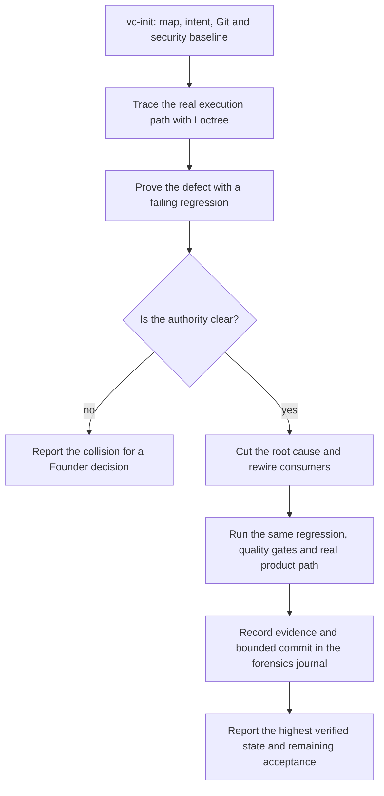

# `vc-forensics` Flow

## Flow

## Routes

| Entry                           | Args                             | Produces                                 | Exit             |
| ------------------------------- | -------------------------------- | ---------------------------------------- | ---------------- |
| `vibecrafted forensics <agent>` | `--prompt` or `--file`           | report, transcript, run metadata         | dispatch receipt |
| `/vc-forensics`                 | bounded investigation and repair | evidence, regression and authored commit | report           |

## Evidence and boundaries

[SKILL.md](SKILL.md) owns the protocol. Use
[references/forensics-evidence-spec.md](references/forensics-evidence-spec.md)
for the proof shape and
[references/forensics-journal-template.md](references/forensics-journal-template.md)
for append-only entries in `./.loctree/forensics/JOURNAL.md`.

- Pin the baseline and inspect `slice` / `impact` before changing a source owner.
- The same regression must fail before the repair and pass after it.
- An ambiguous authority requires a Founder decision; do not add another owner.
- Repository gates do not prove runtime, installation, or delivery. Report each
  acceptance surface at its actual verified level.
- Stage the bounded cut only. Integration, install and release follow the current
  run's authorization and the canonical skill's boundaries.
