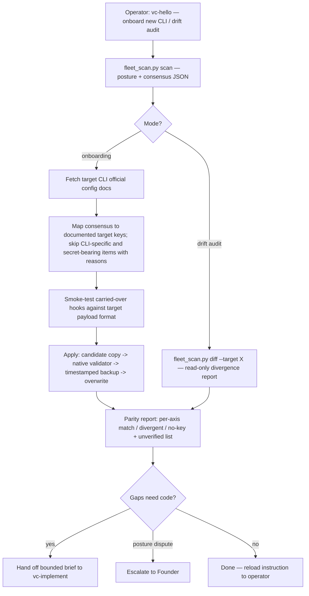

# `vc-hello` Flow

## Flow

## Routes

| Entry                   | Args                                       | Produces                                  | Exit                  |
| ----------------------- | ------------------------------------------ | ----------------------------------------- | --------------------- |
| `vc-hello` (in-session) | target CLI name or "drift <cli>"           | posture.json + parity report / drift.json | `0` on report written |
| `fleet_scan.py scan`    | `--output FILE`                            | fleet posture + consensus JSON            | `0` / `1` on error    |
| `fleet_scan.py diff`    | `--target CLI --output FILE [--posture F]` | per-axis drift report                     | `0` / `1` on error    |

### Escalation edges

- Missing hook script / MCP server that must be built → `vc-implement`.
- Fleet posture conflict without majority (2:2) → Founder decision, recorded in the report.
- New human onboarding beyond configs → `references/onboarding-stack.md` + vibecraftsmanship skill.
