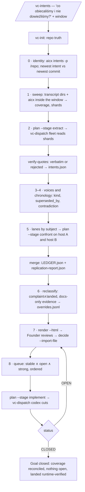

# `vc-intents` Flow

## Flow

## Routes

| Entry                                     | Args                                             | Produces                                                  | Exit                  |
| ----------------------------------------- | ------------------------------------------------ | --------------------------------------------------------- | --------------------- |
| `/vc-intents`                             | window (`--since/--until` or theme), repo by cwd | workdir with ledger, queue, plans, review page            | interactive           |
| `vibecrafted intents <agent>`             | one lane: shard or lane JSON, brief path         | `<shard>.json` or `<lane>.verdicts.json`, report          | `0` on dispatch       |
| `intents_cli.py <workdir> plan --stage …` | `extract` · `confront` · `implement`             | `vibecrafted.dispatch.v1` plan under `<artifacts>/plans/` | `0`                   |
| `intents_cli.py <workdir> status`         | —                                                | counts, open reasons                                      | `0` CLOSED · `1` OPEN |

### Escalation edges

- Two modules compete for the truth an intent needs → `vibecrafted canary <agent>` (confirm in code; canary never refactors)
- The queue is written → `vibecrafted dispatch <intents-implement.*.dispatch.toml>` (codex by default)
- A worker claims a cut landed → `vibecrafted trust <agent>` before the ledger says `landed`
- A contradiction between two Founder statements → `aicx clarify`, then the Founder
- A written plan rather than a corpus is the input → `vibecrafted audit <agent>`

### Session artifacts

- Workdir: `~/.vibecrafted/artifacts/<owner>/<repo>/intents/` — `sweep.json`, `shards/`, `intents.json`,
  `lanes/`, `LEDGER.json`, `LEDGER.md`, `overrides.jsonl`, `replication-report.json`, `queue.json`,
  `STABLE-QUEUE.md`, `intents.html`
- Plans: `~/.vibecrafted/artifacts/<owner>/<repo>/<YYYY_MMDD>/plans/intents-{extract,confront,implement}.<host>.dispatch.toml`
- Fleet verdicts: `<artifacts>/reports/verdicts-<host>/<lane>.verdicts.json`
- Tool hooks: `~/.vibecrafted/loctree/loctree-fail.md`, `~/.vibecrafted/aicx/aicx-fail.md` — append-only; a hook is a claim about a tool, confirm before appending

### Re-entry after a cut or a compaction

`status` → read `LEDGER.md` → `queue` → `plan --stage implement`. Do not re-run
the sweep or the extraction; both are on disk and expensive.
