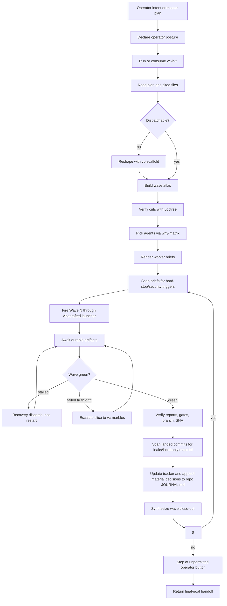

# `vc-operator` Flow

`vc-operator` is the autonomous orchestration posture for a planned
multi-wave dispatch chain.

It conducts. It does not become the worker.

## Core Loop

## Phase Contract

| Phase            | Question                                              | Required output                 |
| ---------------- | ----------------------------------------------------- | ------------------------------- |
| Posture          | Did we explicitly enter operator mode?                | one-line framing shift          |
| Orientation      | Do we have current repo/runtime/intention truth?      | `vc-init` evidence              |
| Plan intake      | Is the full plan and every cited file read?           | input coverage note             |
| Dispatchability  | Can the plan be run as waves?                         | wave atlas or scaffold handoff  |
| Cut verification | Does each cut match repo structure?                   | Loctree annotations             |
| Agent choice     | Who should run each slice?                            | why-matrix rationale            |
| Briefing         | Can a worker execute without guessing?                | rendered dispatch brief         |
| Brief scan       | Does the prompt contain hard-stop/security triggers?  | scan note or refusal            |
| Dispatch         | Did every spawn go through framework telemetry?       | run IDs, tracker, result state  |
| Await            | Did each worker finish, stall, or fail with evidence? | report/transcript/meta state    |
| Recovery         | Is the next action focused, not a blind retry?        | recovery brief or escalation    |
| Commit scan      | Did worker commits leak local-only or sensitive data? | scan note or sanitized recommit |
| Close-out        | What landed and where?                                | wave report, SHAs, gates        |
| Stop             | What remains unpermitted/operator-owned?              | final-goal handoff              |

## Operator Journal

Operator mode keeps two distinct truth surfaces:

- dated trackers/reports under `$VIBECRAFTED_HOME/artifacts/...` - run state,
  run IDs, branches, SHAs, gates, transcripts, and metadata.
- `<repo-root>/.vibecrafted/JOURNAL.md` - the one permanent, append-only,
  Git-tracked Operator Journal.

The tracker lets the operator audit what landed without reading every report.
The journal explains why the wave moved the way it did.
Plan mutations, discovered-fix decisions, integrations, and security guardrail
incidents are journal entries, not memory-only explanations. Dated artifacts
are evidence projections, never alternative canonical journals. Only the
Operator writes the journal; Workers surface falsifiable findings and stay
inside their briefs.

## Routes

| Entry                              | Args                                                                 | Produces                                                   | Exit            |
| ---------------------------------- | -------------------------------------------------------------------- | ---------------------------------------------------------- | --------------- |
| `$vc-operator` in a session        | plan or mandate in context                                           | posture, wave atlas, briefs, journaled decisions           | returns handoff |
| `vibecrafted dispatch <file.toml>` | manifest flags such as `--doctor`, `--dry-run`, `--json`, `--resume` | deterministic dispatch validation/result/tracker artifacts | command status  |
| `vibecrafted dispatch run ...`     | run id, root, report/transcript paths, worker command                | async lifecycle state for one worker                       | command status  |

### Escalation edges

- Need a plan first -> `vibecrafted scaffold <agent>`
- Need shared strategy before dispatch -> `vibecrafted partner <agent>`
- A slice needs solo A to Z delivery -> `vibecrafted ownership <agent>`
- Wave failed on truth drift -> `vibecrafted marbles <agent>`
- Completed chain needs release surface -> `vibecrafted release <agent>`

### Session artifacts

- Artifact root: `$VIBECRAFTED_HOME/artifacts/<org>/<repo>/<YYYY_MMDD>/`
- Tracker/result state: dispatch-specific files under the run artifact root
- Canonical journal: `<repo-root>/.vibecrafted/JOURNAL.md`
- Briefs/close-outs: dated operator-managed run projections
- Lock: `$VIBECRAFTED_HOME/locks/<org>/<repo>/<run_id>.lock`

## Anti-Patterns

- Acting like the implementer instead of the conductor.
- Re-firing a stalled wave without reading the failed worker report.
- Compressing wave status into "green" without SHAs and gate evidence.
- Treating native subagents as external fleet dispatches.
- Authoring worker achievements as operator achievements.
- Personally implementing a discovered adjacent fix instead of deciding,
  briefing, dispatching it into a dedicated worktree, verifying, and
  integrating it.
- Padding journal or handoff output with routine negative-work claims.
- Continuing past an unpermitted operator button.
